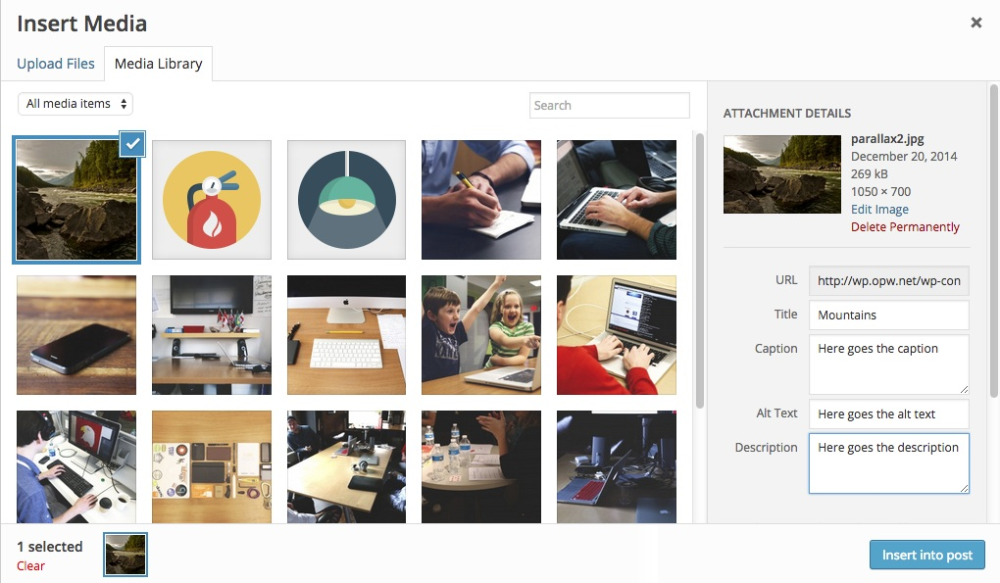

#WPRecipes


## Fetching caption, alt-text & description for the attachments. 
*21/12/2014*


While uploading images or other media files in WordPress, you can input caption, description, alt-text and title in the media popup. Adding these data is mostly straight forward. But how you're going to fetch those data in your theme? `wp_prepare_attachment_for_js()` is the function that you're looking for!



Let's fetch these data

```php
<?php
$attachmentId = 72;
$attachmentDetails = wp_prepare_attachment_for_js($attachmentId);
echo "<pre>";
print_r($attachmentDetails);
```

The output will look like this

```
Array
(
    [id] => 72
    [title] => Mountains
    [filename] => parallax2.jpg
    [url] => http://wp.opw.net/wp-content/uploads/2014/12/parallax2.jpg
    [link] => http://wp.opw.net/?attachment_id=72
    [alt] => Here goes the alt text
    [author] => 1
    [description] => Here goes the description
    [caption] => Here goes the caption
    [name] => parallax2
    [status] => inherit
    [uploadedTo] => 0
    [date] => 1419106116000
    [modified] => 1419106196000
    [menuOrder] => 0
    [mime] => image/jpeg
    [type] => image
    [subtype] => jpeg
    [icon] => http://wp.opw.net/wp-includes/images/media/default.png
    [dateFormatted] => December 20, 2014
    [nonces] => Array
        (
            [update] => ccebcbab96
            [delete] => 538140b381
            [edit] => fc211f2c93
        )

    [editLink] => http://wp.opw.net/wp-admin/post.php?post=72&action=edit
    [meta] => 
    [authorName] => admin
    [filesizeInBytes] => 275869
    [filesizeHumanReadable] => 269 kB
    [sizes] => Array
        (
            [thumbnail] => Array
                (
                    [height] => 150
                    [width] => 150
                    [url] => http://wp.opw.net/wp-content/uploads/2014/12/parallax2-150x150.jpg
                    [orientation] => landscape
                )

            [medium] => Array
                (
                    [height] => 200
                    [width] => 300
                    [url] => http://wp.opw.net/wp-content/uploads/2014/12/parallax2-300x200.jpg
                    [orientation] => landscape
                )

            [large] => Array
                (
                    [height] => 426
                    [width] => 640
                    [url] => http://wp.opw.net/wp-content/uploads/2014/12/parallax2-1024x682.jpg
                    [orientation] => landscape
                )

            [full] => Array
                (
                    [url] => http://wp.opw.net/wp-content/uploads/2014/12/parallax2.jpg
                    [height] => 700
                    [width] => 1050
                    [orientation] => landscape
                )

        )

    [height] => 700
    [width] => 1050
    [orientation] => landscape
)
``` 

That was neat, eh?